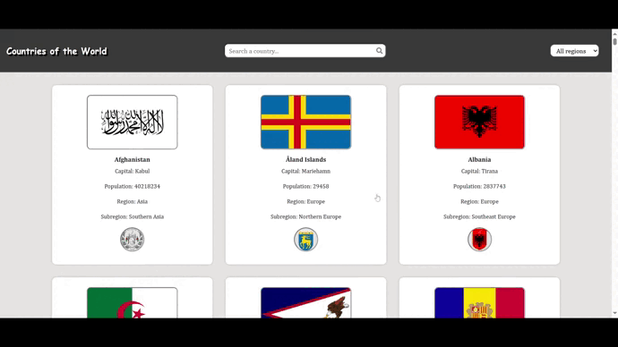
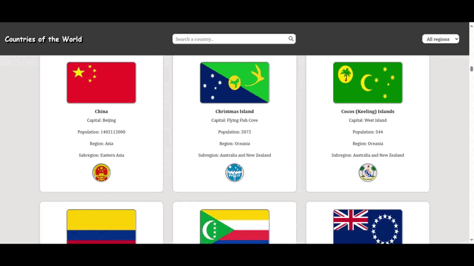

# Rest Countries Info APP [](https://opensource.org/licenses/MIT)  


## - Introducción -

**Rest Countries Info APP** es un pequeño proyecto construido con Django que utiliza  la [API de REST Countries](https://restcountries.com/) y la [API de Wikipedia](https://www.mediawiki.org/wiki/API:Main_page) para visualizar informaciones detalladas de los países del mundo. Este proyecto se ha desarrollado con Python 3.12, JavaScript, Bootstrap 5, HTML5 y CSS3. Es el primer proyecto que subo a Github y el primero en general desarrollado con Django así que es posible que hayan errores, por lo cual cualquier aportación o consejo será bienvenido.

## - Requisitos -

Asegúrate de tener Python instalado en tu sístema, para comprobarlo abre la línea de comandos y ejecuta el siguiente comando:

```bash
    py --version # Windows
    python --version # Unix/macOS
```

Si no tienes Python instalado entra en https://www.python.org/downloads/ y descarga la última versión.

## - Instalación -

1. Clona el repositorio:

```bash
    git clone https://github.com/davevad93/rest-countries-django-app.git
```

2. Entra en la carpeta del repositorio:

```bash
    cd rest-countries-django-app
```
3. Crea un entorno virtual:

```bash
    py -m venv venv # Windows
    python -m venv venv # Unix/macOS
```

4. Activa el entorno virtual:

```bash
    venv/Scripts/activate.bat # Windows
    source venv/bin/activate # Unix/macOS
```

5. Entra en la carpeta del proyecto:

```bash
    cd myproject
```

6. Instala los paquetes necesarios:

```bash
    py -m pip install -r requirements.txt # Windows
    python -m pip install -r requirements.txt # Unix/macOS
```

7. Genera una clave secreta aleatoria y guárdala en el archivo .env: <br/>
 (Esta aplicación no utiliza un sistema de autenticación y no almacena datos sensibles, sin embargo la mejor práctica es crear una clave secreta y almacenarla en una variable de entorno). 

```bash
    # PASO 1: Abre el Shell de Python en el terminal.

    py manage.py shell # Windows
    python manage.py shell # Unix/macOS
```

```bash
    # PASO 2: Importa la función get_random_secret_key().

    from django.core.management.utils import get_random_secret_key
```

```bash
    # PASO 3: Genera la clave secreta con la función get_random_secret_key().

    print(get_random_secret_key())
    # Copia la clave.
```

```bash
    # PASO 4: Cierra el Shell de Python.

    exit()
```

```bash
    # PASO 5: Crea el archivo .env con la variable de entorno "SECRET KEY" y copia la clave generada en el PASO 3. 

    echo SECRET_KEY = 'Pega aquí la clave generada en el PASO 3' > .env
```

8. Pon en marcha el servidor web de desarrollo:

```bash
    py manage.py runserver # Windows
    python manage.py runserver # Unix/macOS
```

9. Accede a la aplicación a través de tu browser web en `http://localhost:8000`.


## - Características -

- ### Busca los países por nombre.


- ### Filtra los países por región.



- ### Visualiza las informaciones detalladas de cada país.


- ### Función de búsqueda haciendo clic en las tarjetas.



## - Anotaciones -

Puede haber inconsistencias con respecto a la información de ciertos países. Esto se debe a que para mostrar las informaciones básicas de cada país he usado la **API de Rest Countries** (última actualización del 2021) mientras que para mostrar las descripciones de los países he usado la **API de Wikipedia** (actualizada constantemente). Por poner un ejemplo, en Rest Countries aparece China como el páis más poblado, pero en 2022 India la ha superado, siendo a día de hoy el páis con más habitantes en el mundo.

## - Desarrollado con -

- [](https://www.python.org)
- [](https://www.djangoproject.com) 
- [](https://www.javascript.com) 
- [](https://getbootstrap.com) 
- [](https://html.com) 
- [](https://css3.com) 

## - Agradecimientos -

- [REST Countries API](https://restcountries.com/) por los **datos de los países** mostrados en la app.

- [Wikipedia API](https://www.mediawiki.org/wiki/) por las **descripciones  de los países** mostrados en la app.

- [Font Awesome](https://fontawesome.com/) por el ícono **fa-search** utilizado en la barra de búsqueda de la app.

- [Awesome Badges](https://github.com/Envoy-VC/awesome-badges) por las insignias en la sección "**Desarrollado con**".

## - Atribuciones -

Algunos escudos de los países mostrados en este proyecto no proceden del [JSON de la API di REST Countries](https://restcountries.com/v3.1/all) porque algunos valores clave están vacíos, así que he exportado los escudos faltantes desde [Wikimedia Commons](https://commons.wikimedia.org/wiki/Main_Page). La mayor parte de ellos están en el dominio público y no necesitan atribución de autoría, pero algunos están bajo licencia de Creative Commons por tanto, voy a citar los autores dándole los créditos.

- [Demidow](https://commons.wikimedia.org/wiki/User:Demidow), [Coat of arms of the British Indian Ocean Territory](https://commons.wikimedia.org/wiki/File:Coat_of_arms_of_the_British_Indian_Ocean_Territory.svg), [CC BY-SA 3.0](https://creativecommons.org/licenses/by-sa/3.0/legalcode)

- [Spedona](https://commons.wikimedia.org/wiki/User:Spedona), [Clunies-Ross family arms](https://commons.wikimedia.org/wiki/File:Clunies-Ross_family_arms.svg), [CC BY-SA 3.0](https://creativecommons.org/licenses/by-sa/3.0/legalcode)

- [Squiresy92](https://commons.wikimedia.org/wiki/User:Squiresy92) & [Sodacan](https://commons.wikimedia.org/wiki/User:Sodacan), [Coat of arms of Norfolk Island](https://commons.wikimedia.org/wiki/File:Coat_of_arms_of_Norfolk_Island.svg), [CC BY-SA 4.0](https://creativecommons.org/licenses/by-sa/4.0/legalcode)

- [Heralder](https://commons.wikimedia.org/wiki/User:Heralder), [Coat of arms of the Commonwealth of Puerto Rico](https://commons.wikimedia.org/wiki/File:Coat_of_arms_of_the_Commonwealth_of_Puerto_Rico.svg), [CC BY-SA 3.0](https://creativecommons.org/licenses/by-sa/3.0/legalcode)

- [Superbenjamin](https://commons.wikimedia.org/wiki/User:Superbenjamin), [Armoiries Réunion](https://commons.wikimedia.org/wiki/File:Armoiries_R%C3%A9union.svg), [CC BY-SA 4.0](https://creativecommons.org/licenses/by-sa/4.0/legalcode)

- [Manassas](https://commons.wikimedia.org/wiki/User_talk:Manassas~commonswiki), [Blason St Barthélémy TOM entire](https://commons.wikimedia.org/wiki/File:Blason_St_Barth%C3%A9l%C3%A9my_TOM_entire.svg), [CC BY-SA 3.0](https://creativecommons.org/licenses/by-sa/3.0/legalcode)


- [Di (they-them)](https://commons.wikimedia.org/wiki/User:Di_(they-them)), [Coat of Arms of Saint Helena](https://commons.wikimedia.org/wiki/File:Coat_of_Arms_of_Saint_Helena.svg), [CC BY-SA 4.0](https://creativecommons.org/licenses/by-sa/4.0/legalcode)

- [Government of the Collectivity of Saint-Martin](https://www.com-saint-martin.fr), [Local flag of the Collectivity of Saint Martin](https://commons.wikimedia.org/wiki/File:Local_flag_of_the_Collectivity_of_Saint_Martin.svg), [Licence Ouverte 2.0](https://www.etalab.gouv.fr/wp-content/uploads/2018/11/open-licence.pdf)

- [Josedar](https://commons.wikimedia.org/wiki/User:Josedar), [Coat of arms of the Turks and Caicos Islands](https://commons.wikimedia.org/wiki/File:Coat_of_arms_of_the_Turks_and_Caicos_Islands.svg), [CC BY-SA 4.0](https://creativecommons.org/licenses/by-sa/4.0/legalcode)

## - Contribuir al proyecto -

Cualquier tipo de aportación es bienvenida! Si encuentras algún problema o tienes algúna sugerencia para mejorar el proyecto, por favor abre una issue o forkea el repositorio y haz una pull request. No te olvides de dar una estrella al proyecto. Muchísimas gracias!

## - Licencia -

Este proyecto está bajo licencia MIT. Para obtener más información, consulta el archivo de [LICENCIA](LICENSE).
